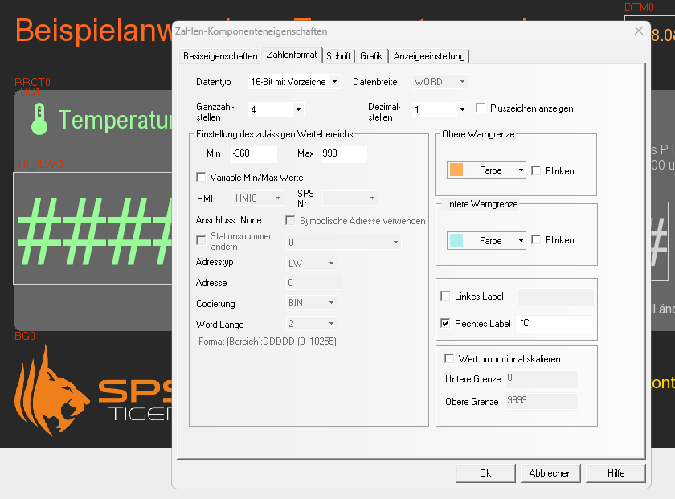
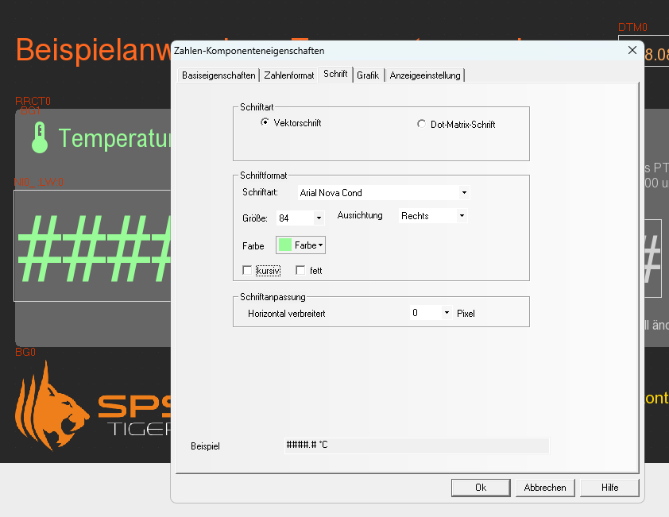
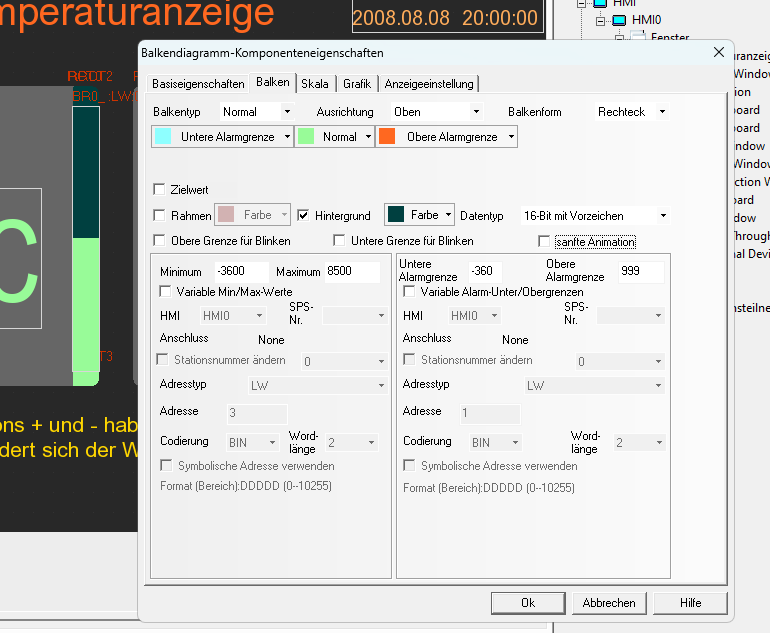
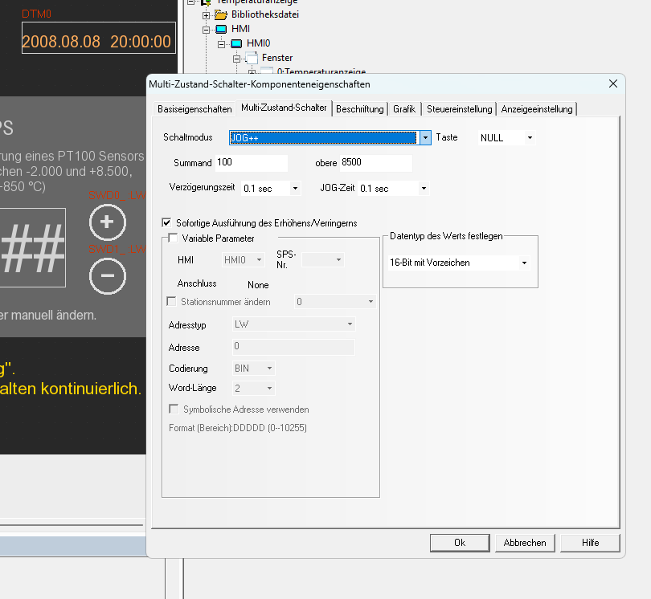

# KincoExampleTemperature

Ein Beispielprojekt für die Anzeige eines Temperaturwerts in einem Kinco HMI.

## Benötige Software

Entwicklungsumgebung für Kinco HMI [Kinco DTools](https://www.spstiger.de/downloads/Kinco%20DTools/Kinco_DTools.zip) Vers. 3.5.3 oder höher

## Funktionen und Anpassungen

Dieses Beispielprogramm für ein Kinco GT070HE zeigt, wie man leicht eine Temperaturanzeige auf dem HMI darstellen kann. Es beinhaltet folgende Funktionen und Anpassungen:

* **Zahlenanzeige** für Temperatur mit Nachkommastellen und Einheit als Label (°C)
* Rechtsbündige Ausrichtung des Werts für bessere Darstellung
* Anpassung aller Schriftarten auf Arial Nova für attraktive Darstellung
* Abgerundetes Rechteck, Überschrift für Messwert und **Icon** als statisches Bitmap (importiertes PNG)
* Simulation eines unskalierten Rohwertes als PT100-Messwert (wie im Temperaturmodul für KS-SPS)
* **Balkendiagramm** rechts neben der Zahl zur grafischen Anzeige des aktuellen Werts
* Eigene Button (selbst erstellte VG-Vektorgrafik) für **Buttons (+) und (-)** für Wertänderung (Hoch / Runter) mit **Jog-Funktion** (Multizustandschalter) 
  *Bei Funktion **Jog** muss die Taste eine Zeit lang gedrückt bleiben, um eine Aktion auszulösen*
* Anpassung der Nummerntastatur mit passender Farbdarstellung und Arial Nova als Tastaturschriftart
* Anpassung der Systemmeldung für falsche Eingabe des Rohwertes - Sprache und Schriftart der Meldung
  
  

*Konfiguration der Dezimalstellen, des Wertebereichs und einer Einheit als Label in der Zahlenkomponente*

*Konfigiration der Schriftart und Ausrichtung der Zahlenkomponente*

*Konfiguration des Balkendiagramms für Farbwechsel, ACHTUNG das Balkendiagramm nutzt den Rohwert und benötigt keine Information zur Anzahl der Dezimalstellen* 

## 

*Konfiguration des Multizustandsschalters für die Funktion Jog, also der kontinuierlichen Wertänderung bei längerem Drücken des Buttons*

## Für welche HMI funktioniert dieses Beispielprojekt?

Das Projekt wurde für das **Kinco HMI GT070HE** mit einer Auflösung von 1.024 x 600 Pixeln erstellt. Die Kinco HMI der GL100E und GT100E-Serie sowie das GT070E2 haben eine gleiche Auflösung. Das Projekt kann für diese Modelle einfach per Rechtsklick auf das HMI in DTools konvertiert werden. 
Für HMI mit anderer Auflösung ist eine Konvertierung über diesen Weg ebenfalls möglich, es werden aber wahrscheinlich Nacharbeiten notwendig, um die Darstellung an das HMI anzupassen.

## Wie starte ich dieses Beispiel?

1. Ladet die aktuelle Version von **Kinco DTools** herunter 
   
   *siehe Link oben*

2. Ladet die Zip-Datei herunter oder **klont** dieses Projekt zum Beispiel über Github Desktop

3. **Öffnet** dieses Projekt in **Kinco DTools** 
   
   *Falls ihr eine neuere Version als 3.5.3 habt, fragt die Software, ob es in die neueste Version konvertiert werden soll, bestätigt mit ja.*

4. Kompiliert das Projekt im Menü **Werkzeuge**

5. Ruft im Menü **Werkzeuge** die **Offline-Simulation** auf

